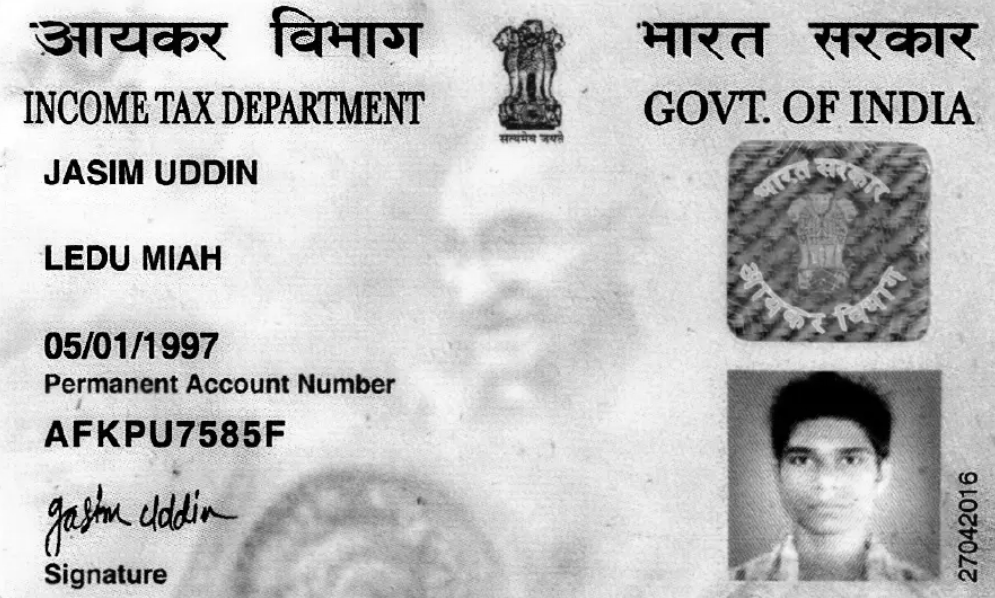
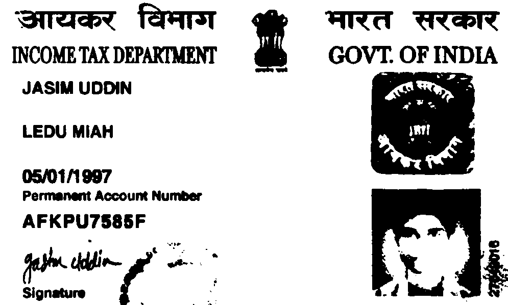
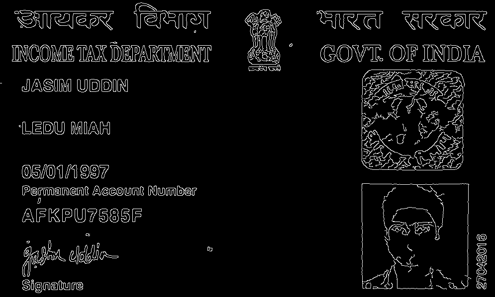
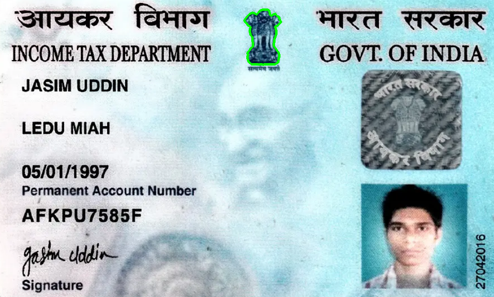

# 📄 AI Document Scanner & OCR Information Extractor

An AI-powered document scanner built using **Python**, **OpenCV**, and **EasyOCR** that preprocesses identity document images, extracts text using Optical Character Recognition (OCR), identifies key information such as document type and ID numbers, and exports the results in a structured JSON format.

---

## 🚀 Features

- 📷 Read identity document images (PAN Card & Aadhaar Card)
- 🖼️ Image preprocessing using OpenCV
  - Grayscale conversion
  - Gaussian Blur
  - Thresholding
  - Edge Detection
- 🤖 OCR using EasyOCR
- 🔍 Detect document type (PAN Card / Aadhaar Card)
- 📝 Extract important fields
  - Name
  - PAN Number
  - Aadhaar Number
- 📦 Export extracted information to JSON

---

## 🛠️ Tech Stack

- Python
- OpenCV
- EasyOCR
- NumPy
- Regular Expressions (Regex)
- JSON

---

## 📂 Project Structure

```
AI-Document-Scanner/
│
├── images/
│   ├── sample adhaar card.png
│   └── sample pan card.png
│
├── screenshots/
│   ├── gray_image.png
│   ├── threshold_image.png
│   ├── edges.png
│   ├── largest_contour.png
│   └── result_json.png
│
├── output/
│
├── scanner.py
├── requirements.txt
├── .gitignore
└── README.md
```

---

## ⚙️ Installation

Clone the repository:

```bash
git clone https://github.com/chavvalaalasa2005-laalasa/AI-Document-Scanner-OCR-Information-Extractor.git
```

Move into the project directory:

```bash
cd AI-Document-Scanner-OCR-Information-Extractor
```

Install dependencies:

```bash
pip install -r requirements.txt
```

Run the project:

```bash
python scanner.py
```

---

## 🔄 Project Workflow

```
Input Document
       │
       ▼
Read Image (OpenCV)
       │
       ▼
Grayscale Conversion
       │
       ▼
Gaussian Blur
       │
       ▼
Thresholding
       │
       ▼
Edge Detection
       │
       ▼
EasyOCR Text Extraction
       │
       ▼
Regex-Based Information Extraction
       │
       ▼
Structured JSON Output
```

---

## 📸 Screenshots

### Original Document

> Add your original document image here.

### Grayscale Image



---

### Threshold Image



---

### Edge Detection



---

### Largest Contour



---

### Sample JSON Output

```json
{
    "document_type": "PAN Card",
    "name": "JASIM UDDIN",
    "pan_number": "AFKPU7586F",
    "aadhaar_number": "Not Found"
}
```

---

## 📈 Future Improvements

- Support passport and driving license OCR
- Improve field extraction accuracy
- Perspective correction for tilted documents
- Streamlit web interface for document upload
- Support multiple languages
- Confidence score for extracted fields

---

## 🎯 Learning Outcomes

This project helped me understand:

- Computer Vision fundamentals
- Image preprocessing using OpenCV
- OCR with EasyOCR
- Regex-based information extraction
- JSON data handling
- Git and GitHub project management

---

## 👩‍💻 Author

**Chavva Laalasa**

GitHub: https://github.com/chavvalaalasa2005-laalasa

---
